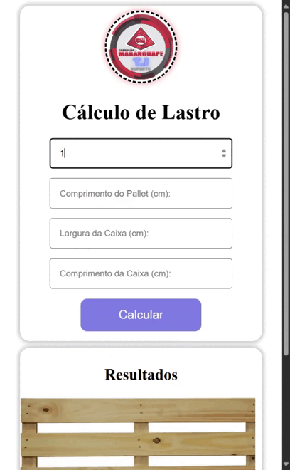

# Calculadora de capacidade de pallet
 uma simples solução para ajudar no árduo trabalho de cadastro de produtos em um outro sistema que pede a quantidade de caixas para completar o lastro de um pallet.

 ## como usar
 basta fornecer as seguintes informações no formulario:
- Largura do pallet
- Comprimento do pallet
- Largura da caixa
- Comprimento da caixa
  
e apertar o botao ````Calcular````

<p align='center'>
  
</p>
